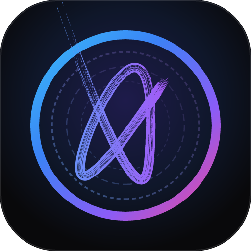

<h1 align="center">
  <br>
  
  <br>
  Record Synth
  <br>
</h1>

<h4 align="center">Next-Gen Cross-Platform Music Synthesis Studio, Beat Sequencer & Glicol Live DSP Engine</h4>

<p align="center">
  <a href="https://github.com/record10/record-synth-public/releases/latest">
    
  </a>
  <a href="https://github.com/record10/record-synth-public/issues">
    
  </a>
  
  
</p>

<p align="center">
  <b>Record Synth</b> is a powerful, modern music synthesis and electronic production studio built with a high-performance <b>Rust audio engine</b>, live <b>Glicol DSP live coding console</b>, dynamic multi-track beat matrix, and an intuitive Angular + Tauri interface. Design modular synth voices, sequence polyrhythmic EDM grooves, and save human-readable Glicol project files directly into an ultra-fast local SQLite database.
</p>

---

## ⚡ Key Highlights

- 🎹 **Modular Voice Designer & Lab**: Create custom synth voices, analog chords, 808 sub-basses, and punchy drum elements with real-time envelope and filter control.
- 🥁 **Dynamic Multi-Track Sequencer**: 16/32/64-step polyrhythmic beat sequencer with real-time velocity, sidechain compression simulation (PUMP), and master global filtering.
- 💻 **Glicol Live Coding DSP Console**: Full live-coding capabilities with live syntax evaluation, real-time audio visualization, and instantaneous sound execution.
- 💾 **Pure Glicol SQLite Storage**: Projects persist as human-readable Glicol scripts with metadata pragmas in an embedded SQLite database, giving you 100% portable audio code.
- 🎛️ **High-Precision Haptic Controls**: Smooth logarithmic frequency sliders, tempo controls, and instant preset pickers tailored for tactile studio performance.
- 📱 **Cross-Platform Everywhere**: Native builds for macOS (Apple Silicon & Intel), Windows, Linux, and Android tablets & phones.

---

## 🚀 Downloads

Download the latest installer for your platform from the [**Releases Page**](https://github.com/record10/record-synth-public/releases/latest):

| Platform | Installer File | Architecture |
| :--- | :--- | :--- |
| 🍏 **macOS (Apple Silicon)** | `RecordSynth-aarch64.dmg` | Apple Silicon (M1/M2/M3/M4) |
| 🍏 **macOS (Intel)** | `RecordSynth-x86_64.dmg` | Intel 64-bit |
| 🪟 **Windows** | `RecordSynth_x64-setup.exe` | Windows 10 / 11 (64-bit) |
| 🐧 **Linux (AppImage)** | `record-synth_amd64.AppImage` | Universal Linux |
| 🐧 **Linux (Debian/Ubuntu)** | `record-synth_amd64.deb` | Debian / Ubuntu |
| 🤖 **Android** | `RecordSynth-arm64.apk` | Android 8.0+ (ARM64) |

---

## 🔧 Installation Instructions

### macOS
1. Download `RecordSynth-aarch64.dmg` (or Intel version) from [Releases](https://github.com/record10/record-synth-public/releases/latest).
2. Open the `.dmg` and drag **Record Synth** to your **Applications** folder.
3. If macOS displays an unsigned app prompt on first launch, clear the quarantine flag once in Terminal:
   ```bash
   xattr -cr "/Applications/Record Synth.app"
   ```

### Windows
1. Download `RecordSynth_x64-setup.exe` from [Releases](https://github.com/record10/record-synth-public/releases/latest).
2. Run the installer. If Windows SmartScreen appears, click **"More info"** → **"Run anyway"**.

### Linux
- **AppImage**:
  ```bash
  chmod +x record-synth_amd64.AppImage
  ./record-synth_amd64.AppImage
  ```
- **Debian / Ubuntu**:
  ```bash
  sudo dpkg -i record-synth_amd64.deb
  ```

### Android
1. Download `RecordSynth-arm64.apk` from [Releases](https://github.com/record10/record-synth-public/releases/latest).
2. Allow installation from your browser/files app when prompted.

---

## 💬 Community & Bug Reporting

Found a bug, have a feature idea, or need help? 
Submit an issue on our public GitHub repository:

👉 [**File a Bug Report or Feature Request**](https://github.com/record10/record-synth-public/issues)

---

## 📜 License

All rights reserved. Provided as-is for music creation and audio synthesis.
